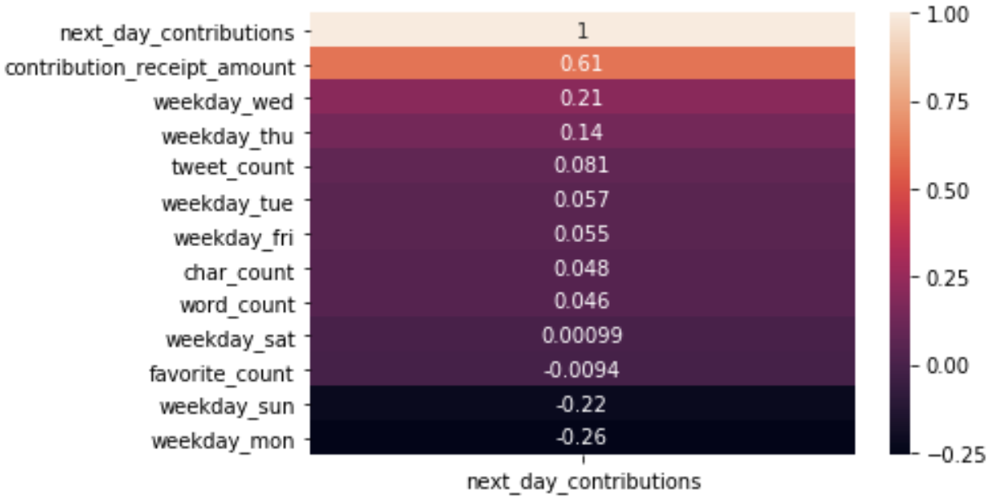
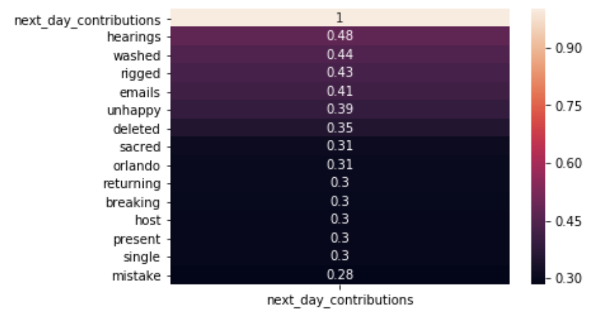
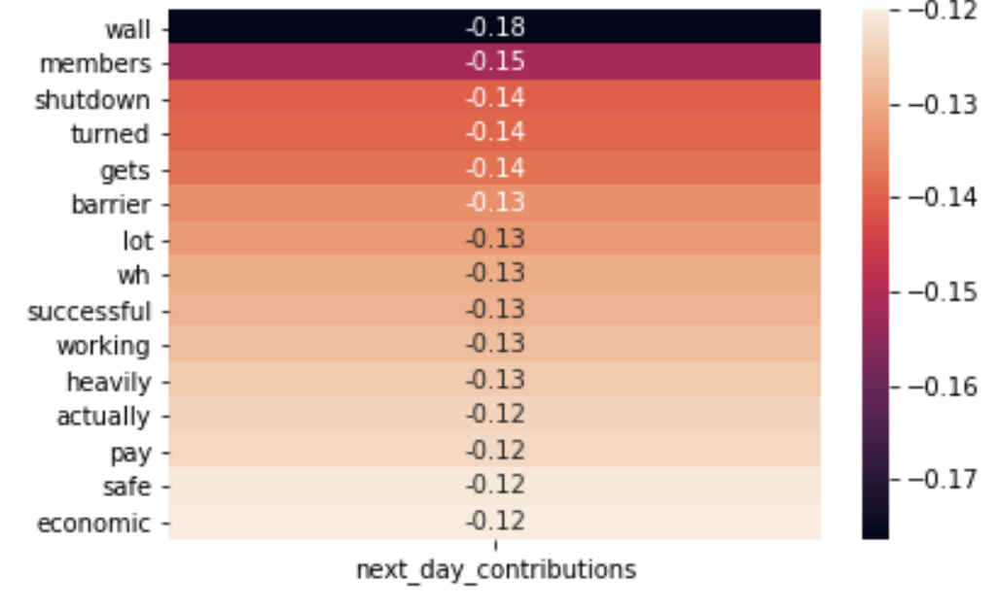
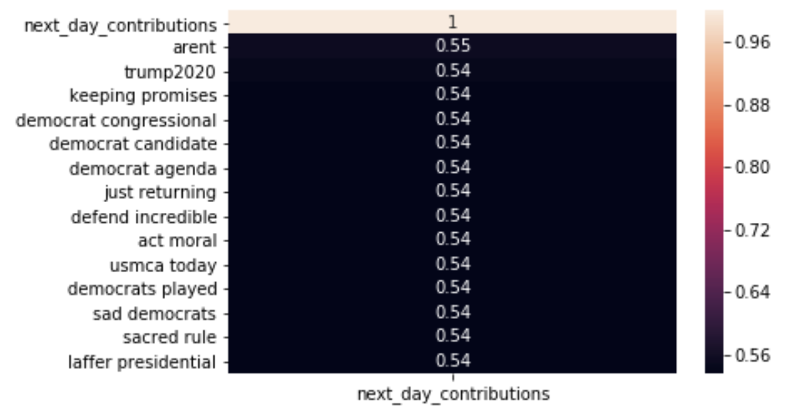
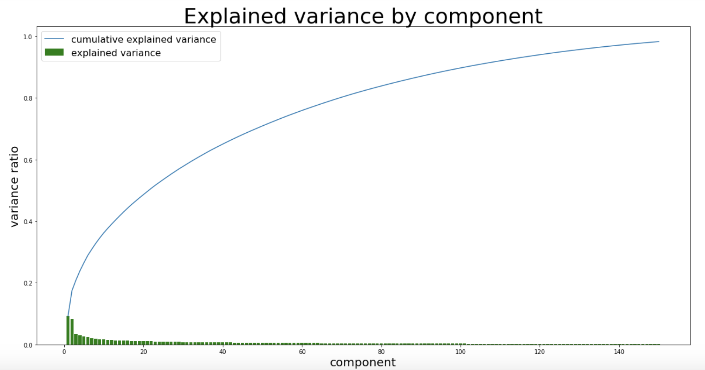
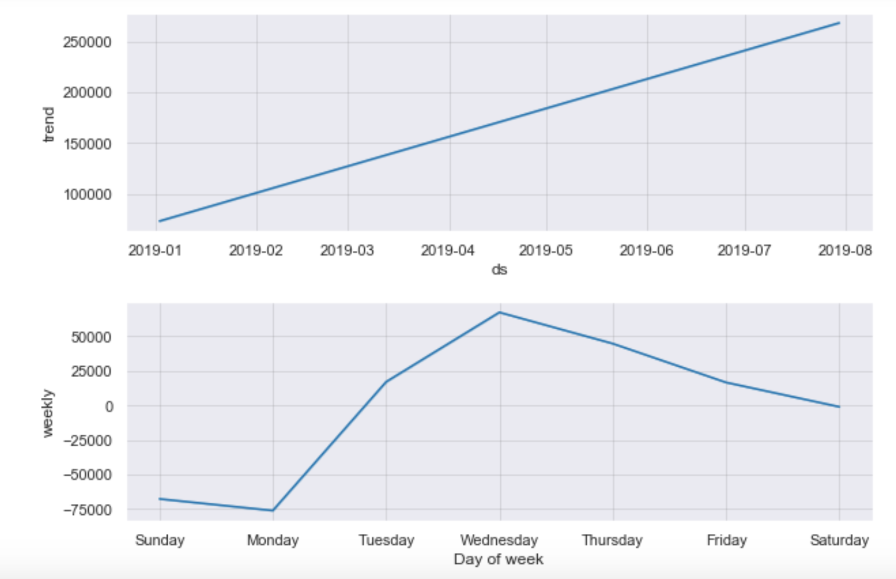

# Trump-Tweeter-NLP-Campaign-Analysis
### Authored by: Trevor McElhaney  

## Problem Statement 

With the upcoming 2020 presidential election and the ever-growing importance of social media to communicate campaign messages, the goal of this repository is to determine whether or not candidate tweets have predictive power on their campaign donations. Specifically, this project focuses on using Natural Language Processing and time-series analysis to evaluate Donald Trump's tweets and to find correlation to whether or not his campaign donations go up or down based upon them. The success of this project is based on whether or not any information on donations can be gained from the analysis. The predictive power of the models will be measured against the naive accuracy of 51.9%.  

## Data dicionary  
|Feature|Type|Dataset|Description|
|-------|----|-------|-----------|
|text|object|full_dataset.csv|Text from the @therealdonaldtrump twitter account.|
|created_at|object|full_dataset.csv|Date and time of tweet post.|
|favorite_count|integer|full_dataset.csv|Number of times the tweet post has been marked as a user's favorite.|
|tweet_count|integer|full_dataset.csv|The number of twitter posts on the current day.|
|contribution_receipt_amount|float|full_dataset.csv|Daily total campaign donations dollar amount.|

## Repo Structure  
- code folder  
  - Cleaning Data- Contains the gathering, cleaning, and merging of the necessary datasets.
  - Tweet EDA- Contains the initial exploratory data analysis of Trump's tweets and donations.
  - Time Series Analysis- Contains the time series analysis of Trump's campaign donations to find any patterns.
  - Model Predictions-Contains multiple models using the findings of the Tweet EDA to predict whether or not Trump's tweets affect his donations. 
- datasets  
  - frequency_dataset.csv
  - full_dataset.csv
  - lsa_dataset.csv
  - schedule_a-2019-08-07T17_19_59.csv  
  - trump_tweets.csv
- images  
  - Saved images and figures from notebooks  
- presentation
  - A .pdf file for the presentation of findings
  
## Exectutive Summary  

What if istead of looking at the money raised as the sole means to advertise to get votes, we looked at the money raised as an indicator of how many votes you might already have? If candidates started looking at the problem from this perspective, outlets like twitter become even more important. In order to evaluate this, I will be looking at Trump's Twitter feed along side his campaign donations to determine if what he tweets has any impact on how much he raises.  
  
In the year before the 2020 presidential election and with the importance of the outcome for many, candidates are looking for the edge. And as most would suspect the more a candidate spends on thier campaign, the more likely they are to win. "For House seats, more than 90 percent of candidates who spend the most win. From 2000 through 2016, there was only one election cycle where that wasn’t true: 2010."[[1]](https://fivethirtyeight.com/features/money-and-elections-a-complicated-love-story/) This doesn't tell the whole story though. Suprisingly, in "big" elections like presidential general elections the more a candidate spends on advertising actually has little affect on the outcome. [[1]](https://fivethirtyeight.com/features/money-and-elections-a-complicated-love-story/) This is where twitter and social media come into play... The whole point to spending large amounts of money on a campaign is to get the candidates message out. Typically, this takes a large amount of money, but social media has word of mouth free advertisement you can't buy.  

The assumption was made that picking a candidate that tweets the most would provide the largest most complete dataset available for NLP analysis. Thus, Trump was selected for this project. To determine the success of his tweeting in regards to his campaign, both the analysis and modeling will be used to determine whether or not his donations go up as a result of his words.  

In gathering the data for Trump's Twitter account @therealdonaldtrump, the Twitter API was very limited allowing non-paying users to pull only 200 tweets going back only 30 days. Because of this, an archived dataset was downloaded from the [Trump Twitter Archive](http://www.trumptwitterarchive.com/archive). This dataset included all non-retweeted posts from January 1, 2019 until June 30,2019. Please refer to the original dataset in this repository's datasets folder for complete dataset information. The twitter dataset was then joined with a dataset gathered from [FEC.gov](https://www.fec.gov/data/candidates/president/?election_year=2020&cycle=2020&election_full=true)(Federal Election Commitee).This dataset is a comprehensive set of all donations made to the Trump presidential campaign between Jan. 1, 2019 and June 30,2019. By law all candidates must post quarterly reports of all inidividual donations to their campaign. Thus as of the time of this project, this was he most up-to-date filing available. "The Federal Election Commission (FEC) is the independent regulatory agency charged with administering and enforcing the federal campaign finance law. The FEC has jurisdiction over the financing of campaigns for the U.S. House, Senate, Presidency and the Vice Presidency."[[2]](fec.gov/about/mission-and-history/)  

After the data was pre-processed and cleaned, the exploratory data analysis(EDA) was used to determine what if any informaton could be gained for predicting campaign contributions. The EDA process was undertaken as a means for a regression model trying to predict actual campaign contributions given to Trump the following day.  

Trump averaged just under $150k per day during the specified time period and his tweets almost averaged one million likes per day. When you break it down each tweet that he made was favorited on average 100k times. There were two outliers for his campaign contributions. on June 18th and 19th Trump's campaign raised almost $2 million. This bump in donations was due to the fact he officially announced his re-election bid on June 18th.[[3]](https://www.usatoday.com/story/news/politics/2019/05/31/donald-trump-formally-declare-re-election-bid-june-18-florida/1303932001/) Wednesdays had the highest correlation to his donation amounts while Sundays and Mondays had negative correlations. This was confirmed by both a time series analysis and a correlation map.  

  

I used two bag-of-words models to try and find correlations between Trump's tweets and his campaign donations. First, countveoctorizing his tweets did reveal some correlation between conspiracy words such as: rigged, hearings, washed, emails, etc. The top words correlated with Trump's contribution amounts were subjectively negative such as breaking, mistake, and unhappy.  

 

This was in contrast to the words found to be negatively correlated with his donaions, which seemed subjectively more positive. See below:   

 

Also, notice that the more Trump mentions the Mexico Border wall the lower his contributions are.  

The second bag-of-words model I used was Term Frequency-Inverse Document Frequency(TF-IDF). The purpose of using this model in addition to countvecotor was to look for the importance of words and phrases in a document(tweet) in relationship to the corpus(all his tweets). The model did pick up on high correlation from Trump mentioning Democrats to his contribution amounts.    
   

Given the overall subjective negativity observed in the bag-of-words models I did do a sentiment analysis on Trump's tweets. There was a small correlation to donations, but the decision was made that the sentiment signal was not strong enough to consider significant.  

Using Singular Value Decomposition(SVD), I ran a LSA transformation and analysis on both the countvectorized and tf-idf transformed tweets, given they both had some correlation to the campaign donations. While the LSA components for the tf-idf tweets didn't account for any  more variance in the data than the non-transformed features, the LSA components for the countvector transformed data did give some more signal than the features alone.  

 

In the initial EDA there was some correlation to day of the week and donatations. This prompted a time series analysis of the data seperate from the NLP analysis. 

 

The time series analysis confirmed that there is seasonality in Trump's donations. Wednesday's do get a bump in donations and weekends are usually slower. This could be cause by multiple factors, but intuitively people tend to be less financialy active on the weekends, due to institute closures. There is also an upward trend in his donations. This is more than likely caused by the fact it is getting closer to the 2020 election. In fact, it is confirmed he will keep raising more money because he is the only candidate sinse Reagan to raise this much prior to this point in an election cycle.[[4]](https://www.washingtonpost.com/politics/trump-tops-100-million-in-fundraising-for-his-own-reelection/2018/10/15/9ee33594-d094-11e8-83d6-291fcead2ab1_story.html?noredirect=on)  

## Conclusions & Further Study

With only a 64% accuracy in predicting whether or not Trump's campaign donations will go up or down, his tweets don't seem to have a significant effect on his donations. However, as determined in the EDA there is some signal coming from his tweets. Finally, the modeling process was used to detemine whether or not there was signal in the tweets that could predict donation amounts. The first model used was a regression model trying to predict actual donation amounts. Results were vey bad and the accuracy was non-existent. The final models used were classification, including logistic regression, random forest classification, Gaussian Bayes, and XGboost. There is some signal coming from Trump's tweets to predict what his campaign donations are going to be. Although, none of the models were able to predict whether or not his donations would go up or down with an accuracy above 64.4%. Intuitively this might make sense. Trump's tweets tend to be reactionary to events happening in the world, thus the predictive ability of his tweets might be residual signal from other factors. As mentioned in the original cleaning of the data it might make sense to look at other information such as who specifically gave donations or at what frequency. My conclusion is that there isn't any significant reason to believe the words in Trump's tweets influence his campaign donations.  

Given more time and resources it might make sense to run the different bag-of-words models through a neural network. In order to do this more data would have to be gathered. The limitations of time series analysis is the amount of data available. While the donations dataset is comprehensive and granular down to the minute, the FEC only releases the information once per quarter. Later iterations of this study should include a larger time period. Also, correlations were only studied in regards to Trump's own donations. There might be correlations to campaigns counter to Trump. Campaigns like Revolution Blue might gain more donations due to Trump's twitter posts. 

## Resources 
- [[1] How Money Affects Election, Maggie Koerth-Baker](https://fivethirtyeight.com/features/money-and-elections-a-complicated-love-story/)
- [[2] FEC.org](fec.gov/about/mission-and-history/)
- [[3] USA Today- Donald Trump to formally declare his re-election bid on June 18 in Orlando](https://www.usatoday.com/story/news/politics/2019/05/31/donald-trump-formally-declare-re-election-bid-june-18-florida/1303932001/)
- [[4] Trump tops $100 million in fundraising for his own re-election-Washington Post](https://www.washingtonpost.com/politics/trump-tops-100-million-in-fundraising-for-his-own-reelection/2018/10/15/9ee33594-d094-11e8-83d6-291fcead2ab1_story.html?noredirect=on)
